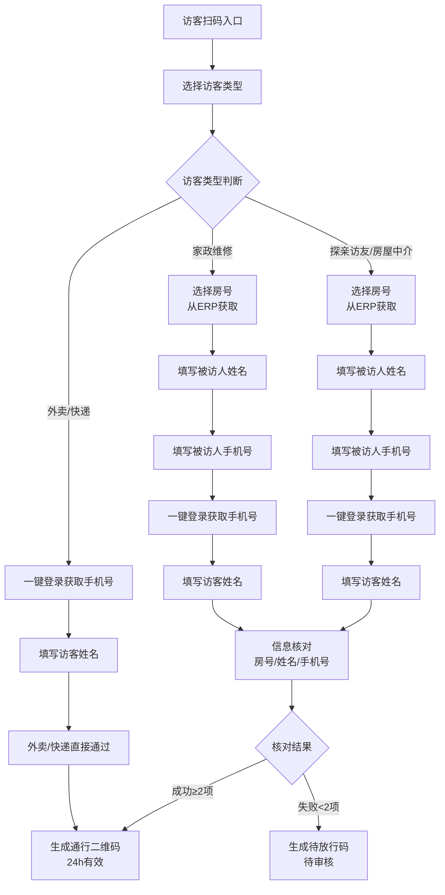
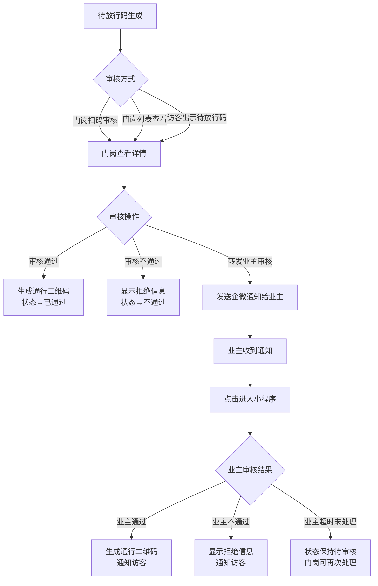
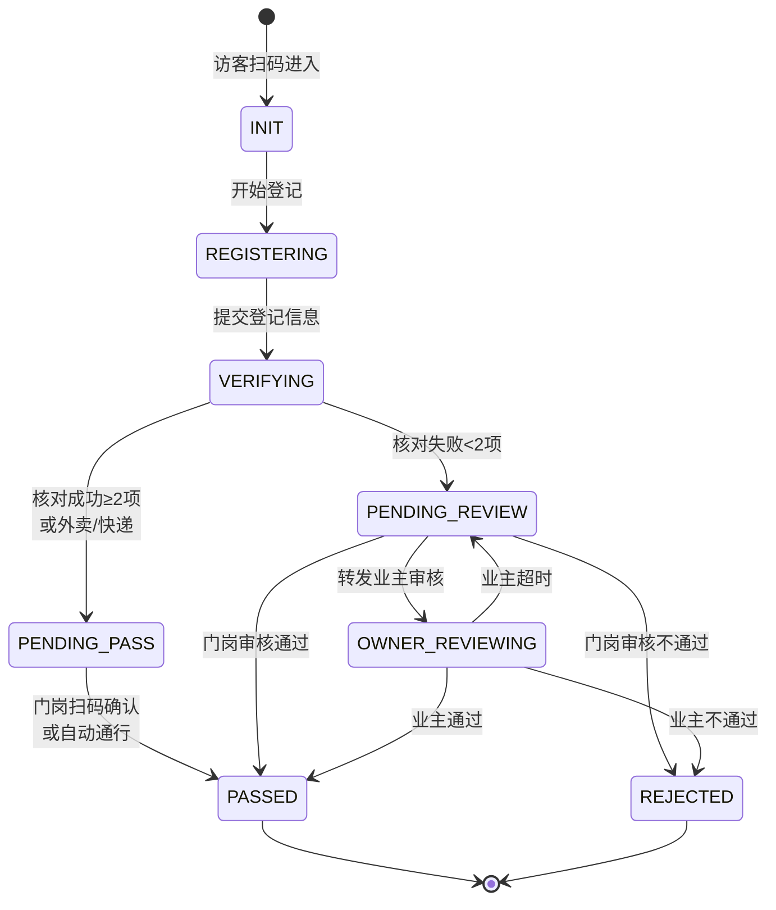
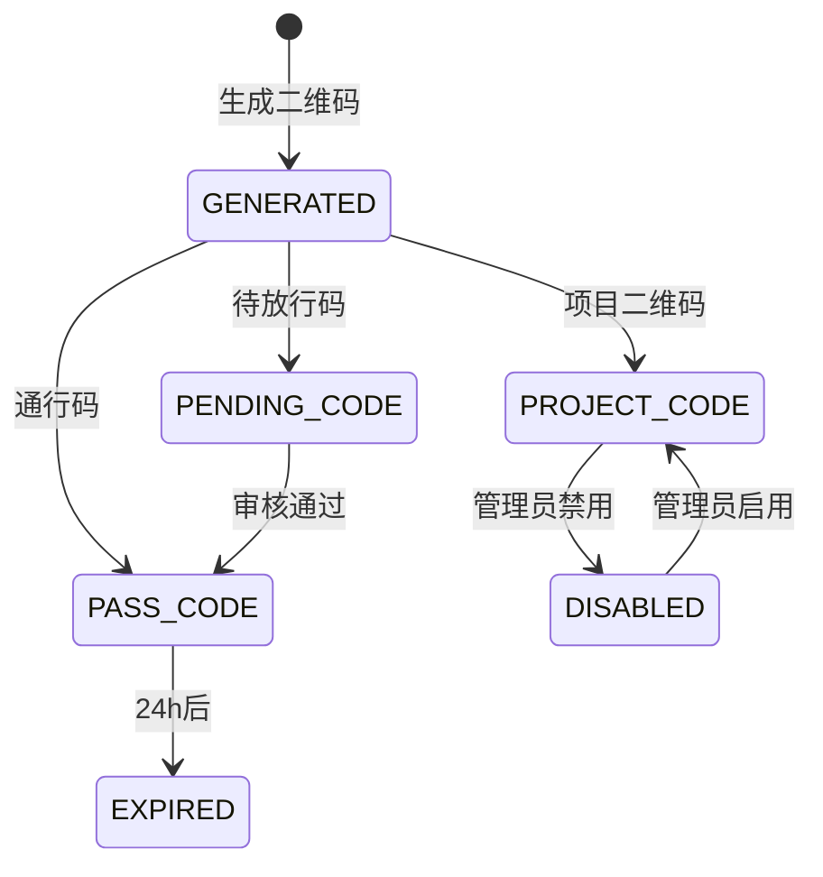
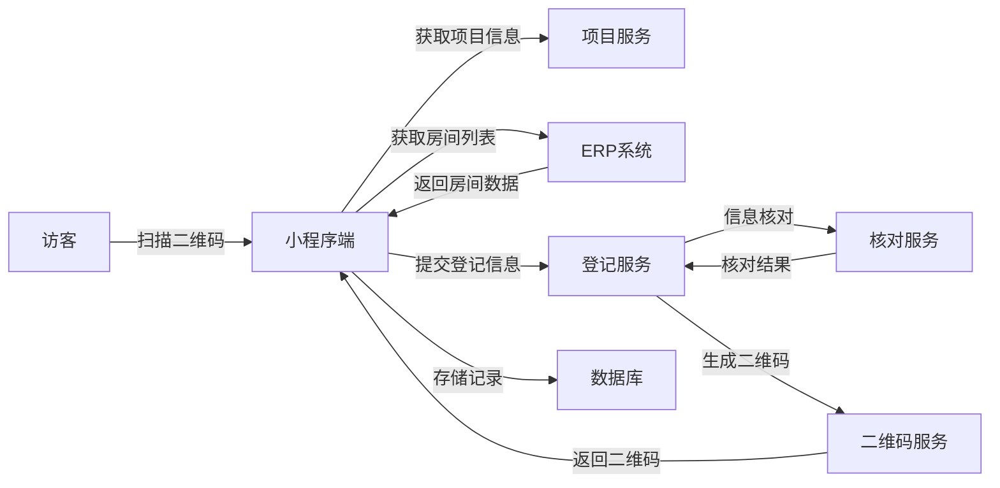
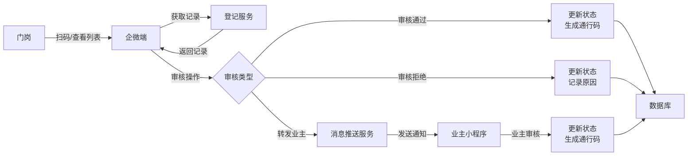
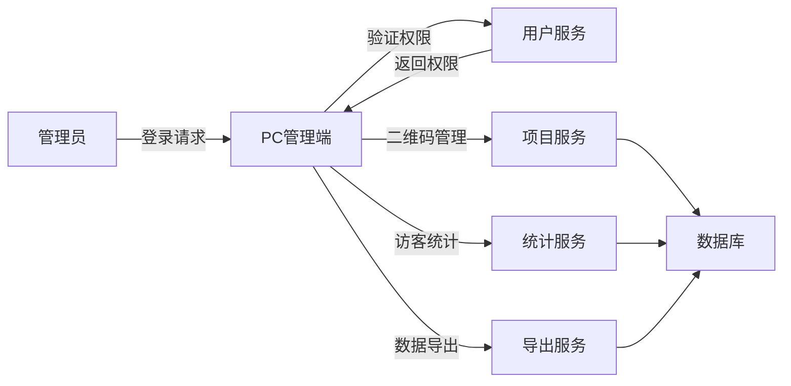

# 访客登记系统 PRD

| 版本 | V1.0 |
|------|------|
| 状态 | Official |
| 作者 | ProductManager Agent |
| 日期 | 2026-03-26 |
| 平台 | 小程序 / 企微端 / PC管理端 |

---

## 1. 产品概述与背景

### 1.1 背景

项目来访登记以往是通过线下纸质登记完成,存在以下痛点:
- **效率低下**: 访客需手动填写纸质表格,耗时较长
- **难以追溯**: 纸质记录不易保存和查询,历史数据难以追溯
- **信息不准确**: 手写信息可能模糊不清或填写不完整
- **审核流程繁琐**: 需要人工核实访客身份,沟通成本高
- **数据利用率低**: 无法进行有效的数据统计和分析

### 1.2 产品目标

通过线上化手段实现访客扫码登记、生成访客二维码、业主审批放行等功能,达到以下目标:

**效率提升**
- 访客登记时间缩短 70% (从平均 2 分钟降至 30 秒)
- 门岗审核效率提升 50%
- 减少纸质登记成本

**风险控制**
- 访客信息完整可追溯,满足合规要求
- 24 小时通行码有效期,降低安全风险
- 三级权限管理,确保数据安全

**体验优化**
- 访客扫码即登记,无需排队等待
- 业主远程审批,无需现场确认
- 门岗移动审核,提升工作效率

### 1.3 核心价值

| 价值维度 | 具体价值 | 衡量指标 |
|---------|---------|---------|
| 效率提升 | 访客登记效率提升 70% | 登记时长从 2 分钟降至 30 秒 |
| 风险控制 | 访客信息 100% 可追溯 | 历史记录查询成功率 100% |
| 成本节约 | 减少纸质登记成本 | 纸张成本降低 90% |
| 体验优化 | 访客满意度提升 | NPS 提升 30 分 |

---

## 2. 用户角色与权限

### 2.1 用户角色定义

| 角色名称 | 角色说明 | 主要职责 |
|---------|---------|---------|
| 访客 | 前来拜访的外部人员 | 扫码登记、获取通行码 |
| 业主 | 项目内的房屋业主 | 审核访客申请 |
| 门岗 | 项目门口值班人员 | 审核访客申请、转发业主审核 |
| 项目管理员 | 单个项目的管理员 | 管理项目二维码、查看访客统计 |
| 地区管理员 | 管辖多个项目的管理员 | 查看管辖范围内项目数据 |
| 集团管理员 | 集团最高权限管理员 | 查看全部项目数据、系统配置 |

### 2.2 权限矩阵

| 功能模块 | 访客 | 业主 | 门岗 | 项目管理员 | 地区管理员 | 集团管理员 |
|---------|------|------|------|-----------|-----------|-----------|
| 扫码登记 | ✓ | - | - | - | - | - |
| 查看通行码 | ✓ | - | - | - | - | - |
| 审核访客申请 | - | ✓ | ✓ | - | - | - |
| 查看来访记录 | - | - | ✓ | ✓ | ✓ | ✓ |
| 项目二维码管理 | - | - | - | ✓ | ✓ | ✓ |
| 访客数据统计 | - | - | - | ✓ | ✓ | ✓ |
| 数据导出 | - | - | - | ✓ | ✓ | ✓ |
| 跨项目数据查看 | - | - | - | - | ✓ | ✓ |
| 全局数据查看 | - | - | - | - | - | ✓ |

### 2.3 数据权限范围

```
集团管理员
    └── 可访问全部项目数据
        
地区管理员
    └── 可访问管辖范围内项目数据
        
项目管理员
    └── 可访问本项目数据
        
门岗
    └── 可访问本项目待审核记录
        
业主
    └── 可访问自己房号的访客申请
        
访客
    └── 可访问自己的登记记录
```

---

## 3. 业务流程

### 3.1 访客登记主流程



### 3.2 审核流程



---

## 4. 状态机设计

### 4.1 访客登记状态机



**状态说明**:

| 状态码 | 状态名称 | 说明 |
|--------|---------|------|
| INIT | 初始化 | 访客尚未开始登记 |
| REGISTERING | 登记中 | 访客正在填写登记信息 |
| VERIFYING | 核对中 | 系统正在核对访客填写的信息 |
| PENDING_PASS | 待通行 | 已生成通行二维码,等待门岗确认或自动通行 |
| PENDING_REVIEW | 待审核 | 信息核对失败,等待门岗或业主审核 |
| OWNER_REVIEWING | 业主审核中 | 门岗已转发给业主 |
| PASSED | 已通过 | 访客已成功进入 |
| REJECTED | 不通过 | 访客被拒绝进入 |
| EXPIRED | 已过期 | 通行码超过24小时有效期 |

### 4.2 二维码状态机



**二维码类型说明**:

| 类型码 | 类型名称 | 说明 | 有效期 |
|--------|---------|------|--------|
| PASS_CODE | 通行码 | 访客可凭此码通行 | 24小时 |
| PENDING_CODE | 待放行码 | 需要审核后才能通行 | 待审核期间有效 |
| PROJECT_CODE | 项目码 | 张贴在项目门口,供访客扫码登记 | 长期有效,可禁用 |

---

## 5. 领域模型与数据流

### 5.1 核心领域模型

```mermaid
erDiagram
    Visitor ||--o{ VisitorRegistration : "1:N"
    VisitorRegistration ||--o{ ReviewRecord : "1:N"
    Project ||--o{ VisitorRegistration : "1:N"
    Project ||--o{ Room : "1:N"
    Region ||--o{ Project : "1:N"
    Group ||--o{ Region : "1:N"
    User }o--|| Project : "belongs to"
    User }o--|| Region : "belongs to"
    User }o--|| Group : "belongs to"
    
    Visitor {
        string id PK
        string name
        string phone
        enum visitorType
        datetime createTime
        datetime updateTime
    }
    
    VisitorRegistration {
        string id PK
        string visitorId FK
        string projectId FK
        enum visitorType
        string visitorName
        string visitorPhone
        string roomNumber
        string visitedPersonName
        string visitedPersonPhone
        enum status
        string qrCode
        enum qrCodeType
        datetime expireTime
        json verifyResult
        string reviewerId
        enum reviewerType
        datetime reviewTime
        string reviewRemark
        datetime createTime
        datetime updateTime
    }
    
    ReviewRecord {
        string id PK
        string registrationId FK
        string reviewerId
        string reviewerName
        enum reviewerType
        enum action
        string remark
        datetime createTime
    }
    
    Project {
        string id PK
        string name
        string regionId FK
        string qrCodeUrl
        enum qrCodeStatus
        datetime createTime
        datetime updateTime
    }
    
    Room {
        string id PK
        string projectId FK
        string building
        string unit
        string floor
        string roomNumber
        string ownerName
        string ownerPhone
        enum status
    }
    
    User {
        string id PK
        string name
        string phone
        enum userType
        enum role
        string projectId FK
        string regionId FK
        string groupId FK
        string openId
        string enterpriseUserId
        datetime createTime
        datetime updateTime
    }
    
    Region {
        string id PK
        string name
        string groupId FK
        datetime createTime
        datetime updateTime
    }
    
    Group {
        string id PK
        string name
        datetime createTime
        datetime updateTime
    }
```



### 5.2 枚举类型定义

**VisitorType (访客类型)**:
- FAMILY_VISIT: 探亲访友
- HOUSEKEEPING: 家政维修
- REAL_ESTATE: 房屋中介
- DELIVERY: 外卖
- EXPRESS: 快递

**RegistrationStatus (登记状态)**:
- INIT: 初始化
- REGISTERING: 登记中
- VERIFYING: 核对中
- PENDING_PASS: 待通行
- PENDING_REVIEW: 待审核
- OWNER_REVIEWING: 业主审核中
- PASSED: 已通过
- REJECTED: 不通过
- EXPIRED: 已过期

**QrCodeType (二维码类型)**:
- PASS_CODE: 通行码
- PENDING_CODE: 待放行码
- PROJECT_CODE: 项目码

**ReviewerType (审核人类型)**:
- GATEKEEPER: 门岗
- OWNER: 业主
- SYSTEM: 系统自动

**ReviewAction (审核动作)**:
- APPROVE: 通过
- REJECT: 拒绝
- FORWARD: 转发

**UserRole (用户角色)**:
- PROJECT_ADMIN: 项目管理员
- REGION_ADMIN: 地区管理员
- GROUP_ADMIN: 集团管理员
- GATEKEEPER: 门岗
- OWNER: 业主

### 5.3 数据流图

#### 5.3.1 访客登记数据流



#### 5.3.2 审核数据流



#### 5.3.3 PC管理端数据流



---

## 6. 功能需求

### 6.1 小程序端

#### 6.1.1 访客扫码登记

**功能描述**: 访客扫描项目二维码进入登记页面,选择访客类型并填写相关信息。

**页面布局**:
- 顶部: 项目名称、访客类型选择(探亲访友、家政维修、房屋中介、外卖、快递)
- 中部: 根据访客类型显示不同的表单字段
- 底部: 提交按钮

**表单字段**:

| 访客类型 | 必填字段 | 可选字段 |
|---------|---------|---------|
| 探亲访友 | 房号、被访人姓名、被访人手机号、访客手机号、访客姓名 | - |
| 家政维修 | 房号、被访人姓名、被访人手机号、访客手机号、访客姓名 | - |
| 房屋中介 | 房号、被访人姓名、被访人手机号、访客手机号、访客姓名 | - |
| 外卖 | 访客手机号、访客姓名 | - |
| 快递 | 访客手机号、访客姓名 | - |

**业务规则**:
1. 房号从 ERP 系统实时获取,支持搜索和选择
2. 访客手机号通过小程序一键登录获取,失败时允许手动输入
3. 手动输入手机号需验证码验证
4. 探亲访友/家政维修/房屋中介类型需进行信息核对(房号、被访人姓名、被访人手机号)
5. 信息核对成功标准: 3项信息中至少2项匹配
6. 外卖/快递类型无需信息核对,直接生成通行码

**验收标准**:
- [ ] 访客扫码后 1 秒内跳转至登记页面
- [ ] 房号列表加载时间 < 2 秒
- [ ] 一键登录获取手机号成功率 > 95%
- [ ] 表单提交后 2 秒内显示结果

#### 6.1.2 通行码展示

**功能描述**: 访客登记成功后显示通行二维码或待放行码。

**页面布局**:
- 顶部: 状态标识(通行码/待放行码)
- 中部: 二维码图片、动态时间显示
- 底部: 有效期提示、使用说明

**业务规则**:
1. 通行码有效期 24 小时,显示倒计时
2. 待放行码显示"等待审核"状态
3. 二维码包含动态时间验证,防截图盗用
4. 二维码每 30 秒自动刷新一次

**验收标准**:
- [ ] 二维码生成时间 < 2 秒
- [ ] 二维码清晰可扫描
- [ ] 动态时间准确显示
- [ ] 有效期倒计时准确

#### 6.1.3 业主审批功能

**功能描述**: 业主通过小程序审核访客申请。

**入口方式**:
- 企微消息推送的小程序卡片
- 小程序消息通知

**页面布局**:
- 顶部: 访客信息(姓名、手机号、来访时间)
- 中部: 被访房号、访客类型
- 底部: 审核按钮(通过/不通过)

**业务规则**:
1. 业主只能审核自己房号的访客申请
2. 审核通过后生成访客通行码
3. 审核不通过需填写拒绝原因(可选)
4. 审核结果实时通知访客

**验收标准**:
- [ ] 业主收到通知后 3 秒内可进入审核页面
- [ ] 审核操作响应时间 < 1 秒
- [ ] 审核结果通知访客延迟 < 5 秒

### 6.2 企微端

#### 6.2.1 来访记录列表

**功能描述**: 门岗查看来访记录列表,支持筛选和搜索。

**页面布局**:
- 顶部: 筛选条件(状态、日期范围、访客类型)
- 中部: 记录列表,每条记录显示访客姓名、访客手机号、被访房号、状态、时间
- 底部: 分页控件

**列表字段**:

| 字段 | 说明 |
|------|------|
| 访客姓名 | 访客的真实姓名 |
| 访客手机号 | 脱敏显示(中间4位) |
| 访客类型 | 探亲访友/家政维修/房屋中介/外卖/快递 |
| 被访房号 | 如: 1栋1单元101 |
| 被访人姓名 | 业主姓名 |
| 状态 | 待审核/已通过/不通过 |
| 登记时间 | YYYY-MM-DD HH:mm:ss |
| 审核人 | 审核人姓名(如已审核) |

**业务规则**:
1. 列表按登记时间倒序排列
2. 默认显示当天的记录
3. 支持按状态筛选(待审核、已通过、不通过)
4. 支持按日期范围筛选
5. 支持按访客姓名/手机号搜索

**验收标准**:
- [ ] 列表加载时间 < 1 秒
- [ ] 支持下拉刷新
- [ ] 支持上拉加载更多
- [ ] 筛选条件切换响应时间 < 500ms

#### 6.2.2 访客详情查看

**功能描述**: 门岗查看访客详细信息,并进行审核操作。

**页面布局**:
- 顶部: 访客基本信息
- 中部: 被访人信息、登记信息
- 底部: 审核操作按钮(通过/不通过/转发业主)

**详情字段**:

| 字段 | 说明 |
|------|------|
| 访客姓名 | 访客的真实姓名 |
| 访客手机号 | 完整显示 |
| 访客类型 | 探亲访友/家政维修/房屋中介/外卖/快递 |
| 被访房号 | 如: 1栋1单元101 |
| 被访人姓名 | 业主姓名 |
| 被访人手机号 | 完整显示 |
| 登记时间 | YYYY-MM-DD HH:mm:ss |
| 状态 | 待审核/已通过/不通过 |
| 审核人 | 审核人姓名(如已审核) |
| 审核时间 | YYYY-MM-DD HH:mm:ss(如已审核) |
| 审核备注 | 审核人填写的备注(如已审核) |

**业务规则**:
1. 只有"待审核"状态的记录才显示审核按钮
2. 审核通过后生成访客通行码
3. 审核不通过需填写拒绝原因(必填)
4. 转发业主审核需确认业主联系方式

**验收标准**:
- [ ] 详情页加载时间 < 1 秒
- [ ] 审核操作响应时间 < 1 秒
- [ ] 审核结果实时更新

#### 6.2.3 扫码审核

**功能描述**: 门岗扫描访客的待放行码进行审核。

**业务规则**:
1. 扫描待放行码后直接进入访客详情页
2. 扫描通行码显示"该访客已通过审核"
3. 扫描无效二维码显示错误提示

**验收标准**:
- [ ] 扫码识别时间 < 1 秒
- [ ] 扫码识别准确率 > 99%

### 6.3 PC管理端

#### 6.3.1 用户权限管理

**功能描述**: 管理员登录系统,根据权限查看和操作数据。

**登录流程**:
1. 管理员输入账号密码
2. 系统验证权限
3. 根据角色跳转至对应页面

**权限验证规则**:
- 项目管理员: 只能查看和操作本项目的数据
- 地区管理员: 可查看和操作管辖范围内所有项目的数据
- 集团管理员: 可查看和操作全部项目的数据

**验收标准**:
- [ ] 登录响应时间 < 2 秒
- [ ] 权限验证准确率 100%
- [ ] 越权访问拦截率 100%

#### 6.3.2 项目二维码管理

**功能描述**: 管理员查看、下载、启用/禁用项目二维码。

**页面布局**:
- 顶部: 项目筛选(地区管理员/集团管理员)
- 中部: 项目列表,每行显示项目名称、二维码状态、操作按钮
- 底部: 分页控件

**列表字段**:

| 字段 | 说明 |
|------|------|
| 项目名称 | 项目全称 |
| 地区 | 项目所属地区 |
| 二维码状态 | 已启用/已禁用 |
| 创建时间 | YYYY-MM-DD HH:mm:ss |
| 操作 | 查看二维码/下载/启用/禁用 |

**业务规则**:
1. 项目二维码长期有效,除非被禁用
2. 禁用后访客无法使用该二维码登记
3. 启用后恢复二维码使用
4. 二维码下载格式: PNG, 分辨率 300x300

**验收标准**:
- [ ] 二维码生成时间 < 2 秒
- [ ] 二维码下载成功率 > 99%
- [ ] 启用/禁用操作响应时间 < 1 秒

#### 6.3.3 访客统计

**功能描述**: 管理员查看访客数据统计和历史记录。

**页面布局**:
- 顶部: 日期范围选择、项目筛选
- 左侧: 统计卡片(访客总数、各类型占比、时间趋势图)
- 右侧: 历史记录列表

**统计指标**:

| 指标 | 说明 |
|------|------|
| 访客总数 | 选定时间范围内的访客总数 |
| 各类型占比 | 探亲访友/家政维修/房屋中介/外卖/快递的占比 |
| 时间趋势 | 按日/周/月的访客数量趋势图 |
| 审核通过率 | 审核通过数/总审核数 |

**历史记录字段**:

| 字段 | 说明 |
|------|------|
| 访客类型 | 探亲访友/家政维修/房屋中介/外卖/快递 |
| 访客姓名 | 访客的真实姓名 |
| 访客电话 | 完整显示 |
| 被访人姓名 | 业主姓名 |
| 被访人电话 | 完整显示 |
| 被访人房号 | 如: 1栋1单元101 |
| 访客时间 | YYYY-MM-DD HH:mm:ss |
| 状态 | 待审核/已通过/不通过 |
| 审核人 | 审核人姓名(如已审核) |

**业务规则**:
1. 默认显示最近 7 天的数据
2. 支持按日期范围筛选
3. 支持按项目筛选(地区管理员/集团管理员)
4. 支持数据导出(Excel 格式)

**验收标准**:
- [ ] 统计数据加载时间 < 2 秒
- [ ] 图表渲染时间 < 1 秒
- [ ] 数据导出成功率 > 99%

#### 6.3.4 数据导出

**功能描述**: 管理员导出访客数据为 Excel 文件。

**导出字段**:
- 访客类型
- 访客姓名
- 访客电话
- 被访人姓名
- 被访人电话
- 被访人房号
- 访客时间
- 状态
- 审核人
- 审核时间
- 审核备注

**业务规则**:
1. 导出数据受权限限制
2. 导出文件命名: 访客数据_项目名称_日期范围.xlsx
3. 单次导出最多 10000 条记录

**验收标准**:
- [ ] 导出文件生成时间 < 10 秒(1000条以内)
- [ ] 导出文件格式正确
- [ ] 导出数据完整准确

---

## 7. 异常场景处理

### 7.1 小程序端异常场景(8个)

#### EX-001: 二维码已禁用
- **触发条件**: 访客扫描已被禁用的项目二维码
- **系统行为**: 
  - 显示提示信息:"该二维码已停用,请联系物业"
  - 不允许进入登记流程
- **用户操作**: 联系物业或使用其他入口
- **日志记录**: 记录二维码ID、扫描时间、访客手机号

#### EX-002: 二维码已过期
- **触发条件**: 访客扫描已过期的项目二维码
- **系统行为**: 
  - 显示提示信息:"该二维码已失效,请联系物业更新"
  - 不允许进入登记流程
- **用户操作**: 联系物业更新二维码
- **日志记录**: 记录二维码ID、过期时间、扫描时间

#### EX-003: 一键登录失败
- **触发条件**: 访客点击一键登录获取手机号失败
- **系统行为**: 
  - 显示提示信息:"获取手机号失败,请手动输入"
  - 提供手动输入手机号的输入框
  - 发送验证码进行验证
- **用户操作**: 手动输入手机号并验证
- **降级策略**: 允许手动输入,不影响登记流程

#### EX-004: ERP房间数据获取失败
- **触发条件**: 系统从ERP获取房间数据失败
- **系统行为**: 
  - 显示提示信息:"获取房间信息失败,请稍后重试"
  - 提供刷新按钮
  - 记录错误日志
- **用户操作**: 点击刷新按钮重试
- **降级策略**: 允许手动输入房号(需门岗后续确认)

#### EX-005: 网络异常导致提交失败
- **触发条件**: 访客提交登记信息时网络异常
- **系统行为**: 
  - 显示提示信息:"网络异常,请检查网络后重试"
  - 保留已填写的信息
  - 提供重新提交按钮
- **用户操作**: 检查网络后点击重新提交
- **数据保护**: 本地缓存已填写信息,避免重复输入

#### EX-006: 通行码生成失败
- **触发条件**: 系统生成通行二维码失败
- **系统行为**: 
  - 显示提示信息:"生成通行码失败,请稍后重试"
  - 记录错误日志
  - 提供重新生成按钮
- **用户操作**: 点击重新生成按钮
- **重试机制**: 支持最多3次重试

#### EX-007: 访客重复登记
- **触发条件**: 访客在24小时内重复扫描同一项目二维码
- **系统行为**: 
  - 检测到已有有效通行码
  - 显示提示信息:"您已有有效通行码,是否查看?"
  - 提供查看通行码或重新登记选项
- **用户操作**: 选择查看通行码或重新登记
- **业务逻辑**: 重新登记会覆盖原有记录

#### EX-008: 访客信息填写不完整
- **触发条件**: 访客未填写必填信息就点击提交
- **系统行为**: 
  - 显示提示信息:"请填写完整信息"
  - 标红未填写的必填项
  - 禁用提交按钮直到信息完整
- **用户操作**: 补充必填信息后重新提交
- **验证规则**: 实时验证必填项,提交时二次验证

### 7.2 企微端异常场景(7个)

#### EX-009: 企微登录失败
- **触发条件**: 门岗打开企微应用登录失败
- **系统行为**: 
  - 显示提示信息:"登录失败,请检查企微账号权限"
  - 提供刷新按钮
  - 记录错误日志
- **用户操作**: 检查企微账号权限后刷新重试
- **权限验证**: 验证企微账号是否有门岗权限

#### EX-010: 扫码识别失败
- **触发条件**: 门岗扫描访客二维码无法识别
- **系统行为**: 
  - 显示提示信息:"二维码识别失败,请重新扫描"
  - 提供手动输入登记编号的选项
- **用户操作**: 重新扫描或手动输入登记编号
- **降级策略**: 支持手动输入登记编号查询

#### EX-011: 访客记录已被审核
- **触发条件**: 门岗尝试审核已被其他门岗审核的记录
- **系统行为**: 
  - 显示提示信息:"该记录已被审核,无法重复操作"
  - 显示当前审核状态和审核人信息
- **用户操作**: 查看审核结果,无需重复操作
- **并发控制**: 使用乐观锁防止并发审核

#### EX-012: 转发业主失败
- **触发条件**: 门岗转发业主审核时推送失败
- **系统行为**: 
  - 显示提示信息:"转发失败,请检查业主联系方式"
  - 提供重试按钮
  - 记录错误日志
- **用户操作**: 检查业主联系方式后重试
- **失败原因**: 业主未绑定企微、联系方式错误等

#### EX-013: 业主联系方式不存在
- **触发条件**: 门岗尝试转发给业主但该房号无业主信息
- **系统行为**: 
  - 显示提示信息:"未找到该房号业主信息"
  - 建议门岗直接审核或联系物业
- **用户操作**: 直接审核或联系物业补充业主信息
- **数据完整性**: 提示物业补充业主信息

#### EX-014: 列表数据加载失败
- **触发条件**: 门岗打开来访记录列表加载失败
- **系统行为**: 
  - 显示提示信息:"数据加载失败,请下拉刷新"
  - 提供下拉刷新功能
- **用户操作**: 下拉刷新重新加载
- **重试机制**: 自动重试3次,失败后提示用户手动刷新

#### EX-015: 审核操作超时
- **触发条件**: 门岗审核操作时请求超时
- **系统行为**: 
  - 显示提示信息:"操作超时,请检查网络后重试"
  - 自动刷新当前记录状态
  - 避免重复审核
- **用户操作**: 检查网络后重新操作
- **幂等性**: 审核操作支持幂等,避免重复审核

### 7.3 业主审核异常场景(4个)

#### EX-016: 业主未绑定房号
- **触发条件**: 业主收到审核通知但未绑定房号
- **系统行为**: 
  - 显示提示信息:"您尚未绑定房号,无法审核"
  - 引导业主联系物业绑定房号
- **用户操作**: 联系物业绑定房号
- **业务流程**: 物业在PC管理端为业主绑定房号

#### EX-017: 审核链接已失效
- **触发条件**: 业主点击审核通知但链接已过期
- **系统行为**: 
  - 显示提示信息:"审核链接已失效"
  - 显示当前访客登记状态
  - 如仍待审核则提供重新审核入口
- **用户操作**: 通过重新审核入口进入
- **链接有效期**: 通知链接有效期24小时

#### EX-018: 访客记录已被处理
- **触发条件**: 业主审核时发现记录已被门岗处理
- **系统行为**: 
  - 显示提示信息:"该访客已被处理"
  - 显示处理结果和处理人信息
- **用户操作**: 查看处理结果
- **状态同步**: 实时同步审核状态

#### EX-019: 业主多次审核
- **触发条件**: 业主尝试对同一记录多次审核
- **系统行为**: 
  - 显示提示信息:"您已审核过该访客"
  - 显示之前的审核结果
- **用户操作**: 查看审核结果
- **幂等性**: 审核操作支持幂等

### 7.4 PC管理端异常场景(7个)

#### EX-020: 权限验证失败
- **触发条件**: 管理员登录时权限验证失败
- **系统行为**: 
  - 显示提示信息:"权限验证失败,请联系管理员"
  - 不允许进入系统
- **用户操作**: 联系上级管理员分配权限
- **权限管理**: 支持多级权限分配

#### EX-021: 越权访问数据
- **触发条件**: 管理员尝试访问权限范围外的数据
- **系统行为**: 
  - 显示提示信息:"您无权访问该数据"
  - 记录越权访问日志
  - 不返回任何数据
- **用户操作**: 查看权限范围内的数据
- **安全审计**: 记录越权访问日志,定期审计

#### EX-022: 二维码生成失败
- **触发条件**: 管理员生成项目二维码失败
- **系统行为**: 
  - 显示提示信息:"二维码生成失败,请稍后重试"
  - 记录错误日志
- **用户操作**: 稍后重试
- **重试机制**: 支持最多3次重试

#### EX-023: 二维码下载失败
- **触发条件**: 管理员下载二维码图片失败
- **系统行为**: 
  - 显示提示信息:"下载失败,请重试"
  - 提供重试按钮
- **用户操作**: 点击重试按钮
- **降级策略**: 提供右键另存为选项

#### EX-024: 统计数据异常
- **触发条件**: 统计数据计算出现异常
- **系统行为**: 
  - 显示提示信息:"数据统计异常,请稍后重试"
  - 显示部分可用数据
  - 记录错误日志
- **用户操作**: 查看部分数据或稍后重试
- **容错机制**: 部分数据异常不影响整体展示

#### EX-025: 数据导出失败
- **触发条件**: 管理员导出访客数据失败
- **系统行为**: 
  - 显示提示信息:"导出失败,请稍后重试"
  - 记录错误日志
  - 提供重试按钮
- **用户操作**: 点击重试按钮
- **导出限制**: 单次导出最多10000条记录

#### EX-026: 并发操作冲突
- **触发条件**: 多个管理员同时操作同一项目二维码
- **系统行为**: 
  - 检测到数据版本冲突
  - 显示提示信息:"数据已被其他管理员修改,请刷新后重试"
  - 自动刷新最新状态
- **用户操作**: 刷新后重新操作
- **并发控制**: 使用乐观锁防止并发冲突

### 7.5 系统级异常场景(4个)

#### EX-027: 数据库连接失败
- **触发条件**: 系统无法连接数据库
- **系统行为**: 
  - 显示提示信息:"系统繁忙,请稍后重试"
  - 记录严重错误日志
  - 发送告警通知运维人员
- **用户操作**: 稍后重试
- **监控告警**: 自动发送告警通知运维人员

#### EX-028: 第三方服务不可用
- **触发条件**: ERP系统或企微接口不可用
- **系统行为**: 
  - 显示提示信息:"相关服务暂时不可用,请稍后重试"
  - 启用降级策略(如允许手动输入)
  - 记录错误日志
- **用户操作**: 使用降级功能或稍后重试
- **降级策略**: 
  - ERP不可用: 允许手动输入房号
  - 企微不可用: 允许门岗直接审核,不转发业主

#### EX-029: 高并发访问
- **触发条件**: 系统收到大量并发请求
- **系统行为**: 
  - 启用限流策略
  - 部分请求显示"系统繁忙,请稍后重试"
  - 保障已登录用户的正常使用
- **用户操作**: 稍后重试
- **限流策略**: 
  - 单IP限流: 100次/分钟
  - 单用户限流: 50次/分钟
  - 全局限流: 10000次/秒

#### EX-030: 二维码安全验证失败
- **触发条件**: 通行二维码被篡改或伪造
- **系统行为**: 
  - 验证失败
  - 显示提示信息:"二维码无效"
  - 记录安全日志
  - 不允许通行
- **用户操作**: 重新获取有效二维码
- **安全机制**: 
  - 二维码包含数字签名
  - 验证签名防止篡改
  - 记录安全日志供审计

---

## 8. 非功能性需求

### 8.1 安全需求

#### 8.1.1 数据安全

| 安全项 | 要求 | 实现方式 |
|--------|------|---------|
| 数据传输加密 | 所有数据传输使用 HTTPS | TLS 1.2+ |
| 数据存储加密 | 敏感数据加密存储 | AES-256 加密 |
| 密码存储 | 密码不可逆加密存储 | BCrypt 加密 |
| 数据脱敏 | 日志和展示时脱敏 | 手机号中间4位脱敏 |

#### 8.1.2 访问控制

| 安全项 | 要求 | 实现方式 |
|--------|------|---------|
| 身份认证 | 所有用户必须认证后访问 | JWT Token 认证 |
| 权限验证 | 每个操作验证权限 | RBAC 权限模型 |
| 会话管理 | 会话超时自动登出 | Token 有效期 2 小时 |
| 防重放攻击 | 防止请求重放 | 请求时间戳 + Nonce |

#### 8.1.3 二维码安全

| 安全项 | 要求 | 实现方式 |
|--------|------|---------|
| 防篡改 | 二维码内容不可篡改 | 数字签名验证 |
| 防伪造 | 二维码不可伪造 | 服务端生成,包含签名 |
| 防截图盗用 | 二维码截图后失效 | 动态时间验证,30秒刷新 |
| 有效期验证 | 通行码24小时有效 | 服务端验证过期时间 |

#### 8.1.4 审计日志

| 日志类型 | 记录内容 | 保留时长 |
|---------|---------|---------|
| 登录日志 | 用户登录时间、IP、设备 | 6个月 |
| 操作日志 | 用户操作类型、对象、结果 | 12个月 |
| 安全日志 | 越权访问、二维码验证失败 | 24个月 |
| 异常日志 | 系统异常、错误信息 | 12个月 |

### 8.2 性能需求

#### 8.2.1 响应时间

| 操作类型 | 响应时间要求 | 备注 |
|---------|-------------|------|
| 页面加载 | < 2秒 | 首屏加载时间 |
| 列表查询 | < 1秒 | 包含分页查询 |
| 表单提交 | < 2秒 | 包含数据验证 |
| 二维码生成 | < 2秒 | 包含签名生成 |
| 数据导出 | < 10秒 | 1000条以内 |

#### 8.2.2 并发性能

| 性能指标 | 要求 | 备注 |
|---------|------|------|
| 在线用户数 | 支持 1000 人同时在线 | 单项目 |
| 并发请求数 | 支持 100 QPS | 单服务实例 |
| 数据库连接数 | 最大 100 连接 | 单数据库实例 |
| 接口响应时间 | 99% 请求 < 1秒 | 正常负载下 |

#### 8.2.3 性能优化策略

| 优化项 | 优化方式 |
|--------|---------|
| 数据库查询 | 建立索引、分页查询、避免全表扫描 |
| 缓存策略 | Redis 缓存热点数据(项目信息、房间列表) |
| CDN 加速 | 静态资源使用 CDN 加速 |
| 异步处理 | 数据导出、统计计算异步处理 |
| 分库分表 | 访客记录按项目分表,历史数据归档 |

### 8.3 可用性需求

#### 8.3.1 系统可用性

| 指标 | 要求 | 备注 |
|------|------|------|
| 系统可用性 | 99.9% | 年度可用性 |
| 故障恢复时间 | < 30分钟 | 从故障到恢复 |
| 数据备份 | 每日备份 | 保留30天 |
| 灾难恢复 | < 4小时 | RTO < 4小时, RPO < 1小时 |

#### 8.3.2 容错机制

| 容错项 | 容错策略 |
|--------|---------|
| 服务降级 | 第三方服务不可用时启用降级策略 |
| 服务熔断 | 连续失败超过阈值时熔断,防止雪崩 |
| 重试机制 | 失败请求自动重试3次,间隔递增 |
| 熔断恢复 | 熔断后每隔30秒尝试恢复 |

#### 8.3.3 监控告警

| 监控项 | 告警阈值 | 告警方式 |
|--------|---------|---------|
| CPU 使用率 | > 80% 持续5分钟 | 邮件 + 短信 |
| 内存使用率 | > 85% 持续5分钟 | 邮件 + 短信 |
| 磁盘使用率 | > 90% | 邮件 + 短信 |
| 数据库连接数 | > 80% | 邮件 |
| 接口响应时间 | > 3秒 持续5分钟 | 邮件 |
| 错误率 | > 5% 持续5分钟 | 邮件 + 短信 |

### 8.4 兼容性需求

#### 8.4.1 客户端兼容性

| 平台 | 兼容要求 |
|------|---------|
| 微信小程序 | 微信版本 7.0.0+ |
| 企业微信 | 企业微信版本 3.0.0+ |
| PC浏览器 | Chrome 80+, Edge 80+, Firefox 75+ |

#### 8.4.2 设备兼容性

| 设备类型 | 兼容要求 |
|---------|---------|
| iOS 设备 | iOS 12.0+ |
| Android 设备 | Android 6.0+ |
| 屏幕分辨率 | 适配主流分辨率(320px - 1920px) |

### 8.5 可维护性需求

#### 8.5.1 代码规范

| 规范项 | 要求 |
|--------|------|
| 代码风格 | 遵循团队代码规范(ESLint/Prettier) |
| 注释规范 | 关键逻辑必须注释,公共接口必须文档化 |
| 命名规范 | 变量、函数、类命名语义化 |
| 代码审查 | 所有代码合并前必须经过 Code Review |

#### 8.5.2 部署运维

| 运维项 | 要求 |
|--------|------|
| 部署方式 | 容器化部署(Docker + Kubernetes) |
| 配置管理 | 配置文件与代码分离,支持环境变量 |
| 日志管理 | 统一日志格式,集中收集(ELK) |
| 监控体系 | 应用监控 + 基础设施监控(Prometheus + Grafana) |

---

## 9. 需求追溯矩阵

| 需求ID | 需求描述 | 业务目标 | 用户价值 | 优先级 | 验收标准 |
|--------|---------|---------|---------|--------|---------|
| REQ-001 | 访客扫码登记 | 提升登记效率 | 访客快速登记,无需排队 | P0 | 登记时长从2分钟降至30秒 |
| REQ-002 | 访客信息核对 | 降低安全风险 | 确保访客身份真实 | P0 | 核对准确率>95% |
| REQ-003 | 通行码生成 | 提升通行效率 | 访客快速通行 | P0 | 二维码生成时间<2秒 |
| REQ-004 | 门岗审核 | 控制访客进入 | 门岗移动审核,提升效率 | P0 | 审核响应时间<1秒 |
| REQ-005 | 业主审批 | 提升业主体验 | 业主远程审批,无需现场 | P1 | 审核通知延迟<5秒 |
| REQ-006 | 项目二维码管理 | 管理项目入口 | 灵活控制项目访问 | P1 | 二维码生成成功率>99% |
| REQ-007 | 访客统计 | 数据分析决策 | 了解访客情况,优化管理 | P1 | 统计数据加载时间<2秒 |
| REQ-008 | 数据导出 | 数据归档分析 | 导出数据用于分析 | P2 | 导出成功率>99% |
| REQ-009 | 权限管理 | 数据安全隔离 | 多级权限管理 | P0 | 权限验证准确率100% |
| REQ-010 | 异常处理 | 系统稳定性 | 友好提示,降级处理 | P0 | 异常场景覆盖率100% |

---

## 10. 决策日志

| 决策ID | 决策主题 | 决策内容 | 决策原因 | 备选方案 | 决策日期 |
|--------|---------|---------|---------|---------|---------|
| DEC-001 | 访客类型划分 | 划分为5种类型:探亲访友、家政维修、房屋中介、外卖、快递 | 覆盖主要访客场景,外卖/快递简化流程 | 统一流程,不区分类型 | 2026-03-26 |
| DEC-002 | 信息核对标准 | 3项信息中至少2项匹配即通过 | 平衡安全性和便利性 | 全部匹配才通过 | 2026-03-26 |
| DEC-003 | 通行码有效期 | 24小时有效 | 满足访客当天多次进出需求 | 12小时或48小时 | 2026-03-26 |
| DEC-004 | 审核方式 | 支持门岗审核和业主审核两种方式 | 灵活应对不同场景 | 仅门岗审核或仅业主审核 | 2026-03-26 |
| DEC-005 | 二维码安全 | 动态时间验证,30秒刷新 | 防止截图盗用 | 静态二维码 | 2026-03-26 |
| DEC-006 | 权限模型 | 三级权限:项目/地区/集团 | 满足多级管理需求 | 单级权限或两级权限 | 2026-03-26 |
| DEC-007 | 数据导出限制 | 单次最多10000条 | 平衡性能和需求 | 无限制或更小限制 | 2026-03-26 |
| DEC-008 | 降级策略 | ERP不可用时允许手动输入房号 | 提升系统可用性 | 直接拒绝服务 | 2026-03-26 |

---

## 11. 边界条件

### 11.1 功能边界

**范围内功能**:
- 访客扫码登记(5种访客类型)
- 访客信息核对(房号、姓名、手机号)
- 通行码生成与展示(24小时有效)
- 门岗审核(通过/不通过/转发业主)
- 业主审批(通过/不通过)
- 项目二维码管理(生成/下载/启用/禁用)
- 访客统计与查询
- 数据导出(Excel格式)
- 三级权限管理(项目/地区/集团)

**范围外功能**:
- 访客预约功能(原因:V1.0聚焦即时登记,预约功能复杂度高,延后至V1.1)
- 访客人脸识别(原因:涉及隐私合规,硬件成本高,延后至V2.0)
- 访客黑名单(原因:需积累历史数据,延后至V1.1)
- 多项目通行码(原因:跨项目管理复杂,延后至V2.0)
- 访客评价功能(原因:非核心功能,延后至V1.2)

### 11.2 异常场景

| 异常场景 | 处理方式 |
|---------|---------|
| 二维码禁用/过期 | 提示访客联系物业,不允许登记 |
| 一键登录失败 | 允许手动输入手机号,需验证码验证 |
| ERP服务不可用 | 允许手动输入房号,门岗后续确认 |
| 企微服务不可用 | 门岗直接审核,不转发业主 |
| 数据库连接失败 | 显示友好提示,记录错误日志,发送告警 |
| 高并发访问 | 启用限流策略,保障已登录用户 |
| 二维码篡改/伪造 | 验证失败,不允许通行,记录安全日志 |

### 11.3 约束条件

**技术约束**:
- 小程序端基于微信小程序开发
- 企微端基于企业微信应用开发
- PC管理端基于 Vue3 + Element Plus 开发
- 后端基于 Spring Boot 开发
- 数据库使用 MySQL
- 缓存使用 Redis

**业务约束**:
- 访客手机号必须通过一键登录或验证码验证
- 通行码有效期固定24小时,不可延长
- 审核操作不可撤销(已审核记录不可修改)
- 数据导出受权限限制,单次最多10000条

**数据约束**:
- 访客姓名: 2-20个字符
- 访客手机号: 11位数字,符合手机号格式
- 房号: 从ERP获取,格式: 楼栋-单元-楼层-房号
- 审核备注: 最多200个字符

---

## 12. 风险与依赖

### 12.1 风险项

| 风险ID | 风险描述 | 影响程度 | 发生概率 | 应对措施 |
|--------|---------|---------|---------|---------|
| RISK-001 | ERP系统不稳定,房间数据获取失败 | 高 | 中 | 实现降级策略,允许手动输入房号 |
| RISK-002 | 企微消息推送延迟,业主审核不及时 | 中 | 低 | 提供多种通知方式,支持短信通知 |
| RISK-003 | 访客扫码量激增,系统性能不足 | 高 | 低 | 实现限流策略,支持水平扩展 |
| RISK-004 | 二维码被截图盗用 | 高 | 低 | 实现动态时间验证,30秒刷新 |
| RISK-005 | 业主未绑定房号,无法审核 | 中 | 中 | 引导业主联系物业绑定房号 |

### 12.2 依赖项

| 依赖ID | 依赖描述 | 依赖方 | 影响功能 | 应对措施 |
|--------|---------|--------|---------|---------|
| DEP-001 | ERP系统提供房间数据接口 | ERP团队 | 访客登记 | 签订SLA,实现降级策略 |
| DEP-002 | 企业微信提供消息推送接口 | 企业微信 | 业主审核 | 监控接口可用性,提供备选通知方式 |
| DEP-003 | 微信小程序提供一键登录接口 | 微信 | 访客登记 | 实现手动输入手机号降级方案 |
| DEP-004 | 项目二维码已生成并张贴 | 物业 | 访客登记 | PC管理端提供二维码生成和下载功能 |

---

## 13. 路线图

### V1.0 (当前版本)
**发布时间**: 2026-04-30

**核心功能**:
- 访客扫码登记(5种访客类型)
- 访客信息核对
- 通行码生成与展示
- 门岗审核
- 业主审批
- 项目二维码管理
- 访客统计与查询
- 数据导出
- 三级权限管理

**验收标准**:
- 访客登记时长从2分钟降至30秒
- 门岗审核效率提升50%
- 访客信息100%可追溯
- 系统可用性达到99.9%

### V1.1 (计划版本)
**发布时间**: 2026-06-30

**新增功能**:
- 访客预约功能
- 访客黑名单
- 访客历史记录查询(小程序端)
- 业主常用访客管理
- 访客到达提醒

**优化项**:
- 优化信息核对算法,提升准确率
- 优化二维码生成性能
- 优化统计图表展示

### V2.0 (未来版本)
**发布时间**: 2026-09-30

**新增功能**:
- 访客人脸识别
- 多项目通行码
- 访客轨迹追踪
- 智能审核(基于历史数据)
- 访客画像分析

**技术升级**:
- 引入AI算法优化审核
- 引入大数据分析平台
- 引入物联网设备集成

---

## 14. 附录

### 14.1 术语表

| 术语 | 说明 |
|------|------|
| 访客 | 前来拜访的外部人员 |
| 业主 | 项目内的房屋业主 |
| 门岗 | 项目门口值班人员 |
| 通行码 | 访客可凭此码通行,24小时有效 |
| 待放行码 | 需要审核后才能通行 |
| 项目码 | 张贴在项目门口,供访客扫码登记 |
| ERP | 企业资源计划系统,提供房间数据 |
| 企微 | 企业微信 |

### 14.2 参考资料

- 微信小程序开发文档: https://developers.weixin.qq.com/miniprogram/dev/framework/
- 企业微信开发文档: https://developer.work.weixin.qq.com/document/
- Vue3 官方文档: https://vuejs.org/
- Spring Boot 官方文档: https://spring.io/projects/spring-boot

---

## 15. Context Package (交付给UI/UX设计师)

### 15.1 需求ID列表

| 需求ID | 需求标题 | 优先级 |
|--------|---------|--------|
| REQ-001 | 访客扫码登记 | P0 |
| REQ-002 | 访客信息核对 | P0 |
| REQ-003 | 通行码生成 | P0 |
| REQ-004 | 门岗审核 | P0 |
| REQ-005 | 业主审批 | P1 |
| REQ-006 | 项目二维码管理 | P1 |
| REQ-007 | 访客统计 | P1 |
| REQ-008 | 数据导出 | P2 |
| REQ-009 | 权限管理 | P0 |
| REQ-010 | 异常处理 | P0 |

### 15.2 关键决策记录

1. **访客类型划分**: 5种类型,外卖/快递简化流程
2. **信息核对标准**: 3项信息中至少2项匹配
3. **通行码有效期**: 24小时
4. **二维码安全**: 动态时间验证,30秒刷新
5. **权限模型**: 三级权限(项目/地区/集团)

### 15.3 边界条件

**功能边界**:
- 范围内: 访客登记、审核、二维码管理、统计、导出
- 范围外: 访客预约、人脸识别、黑名单、多项目通行码

**异常场景**: 详见第7章节(30个异常场景)

**约束条件**:
- 访客手机号必须验证
- 通行码24小时有效
- 审核操作不可撤销
- 数据导出最多10000条

### 15.4 风险警告

1. **ERP依赖**: 房间数据依赖ERP系统,需实现降级策略
2. **企微依赖**: 消息推送依赖企微,需监控可用性
3. **二维码安全**: 需防止截图盗用,实现动态验证
4. **高并发风险**: 需实现限流策略,支持水平扩展

### 15.5 PRD文档路径

- PRD文档: `d:\Work\原型\业主小程序\访客申请\prd.md`
- 规格文档: `d:\Work\原型\业主小程序\访客申请\.trae\specs\visitor-registration-system\spec.md`

---

**文档结束**
